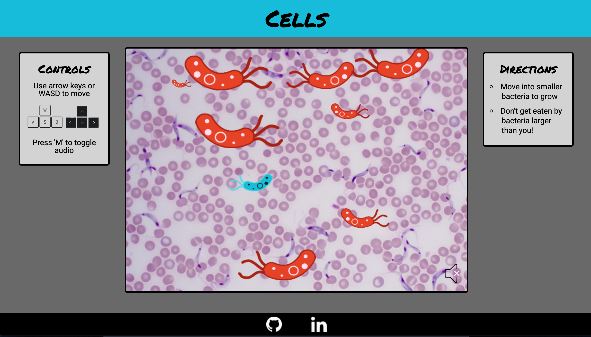

# Cells
[Live Link](https://baustgen.github.io/CellGame/)



Cells is a single player browser game. Users use their keyboard to control a blue bacteria in a Petri dish. Also in the dish are some *nasty* red bacteria of various sizes. It's the goal of our heroic bacteria to swim into red bacteria smaller than itself in order to grow into the biggest bacteria in the dish.

Watch out for bacteria larger than you though. You can only eat cells that are smaller than you, so running into a big bacteria can cost you the game!

## Architecture and Technologies

This project was implemented using the following technologies:

- Vanilla JavaScript for overall structure and game logic
- HTML5 Canvas and vanilla JavaScript DOM manipulation and rendering
- Vanilla JavaScript DOM manipulation for audio playback
- Webpack to bundle game files

## Functionality & MVP

Within the Cells game, users are able to:

- Start the game
- Move their bacteria around the game
- Toggle audio playback on/off

### Bacteria

Fish are rendered using HTML canvas and JavaScript. Enemy bacteria are randomly generated with a variety of sizes, starting positions, and velocities. 

```javascript
class Bacteria {
    constructor() {
        this.scale = Math.floor(Math.random() * 9) + 2;
        this.xDim = (20 * this.scale);
        this.yDim = (8 * this.scale);
        const pos = Bacteria.randomPosition()
        this.xPos = pos[0];
        this.yPos = pos[1];
        this.vel = this.xPos < 0 
            ? Math.floor(Math.random() * 7) + 2 
            : Math.floor(Math.random() * -7) - 2;
    }

    static randomPosition() {
        let x;
        let coin = Math.floor(Math.random() * 2);
        if (coin === 1) {
            x = -200;
        } else {
            x = 750;
        }
        const y = Math.floor(Math.random() * 460) - 10;
        return [x, y];
    }
}
```

### User Control

Users can control the blue bacteria with the "WASD" or arrow keys. Additionally they can toggle audio with the "M" key. THese keybindings were achieved with a JavaScript `keydown` event listener using a switch statement to fire off the appropriate action based on the `keyCode` of the pressed key.

```javascript
bindKeyHandlers() {

    document.addEventListener("keydown", (e) => {
        e.preventDefault();
        switch (e.keyCode) {
            case 65:
                this.game.user.userMove('left');
                break;
        
            case 87:
                this.game.user.userMove('up');
                break;
        
            case 68:
                this.game.user.userMove('right');
                break;
        
            case 83:
                this.game.user.userMove('down');
                break;
        
            case 37:
                this.game.user.userMove('left');
                break;
        
            case 38:
                this.game.user.userMove('up');
                break;
        
            case 39:
                this.game.user.userMove('right');
                break;
        
            case 40:
                this.game.user.userMove('down');
                break;
        
            case 77:
                this.game.audioToggle();
                break;
        
            default:
                break;
        }
    })
}
```


### Sound

Game sounds are implemented using vanilla JavaScript. Background and collision audio can be toggled by the user by clicking on the speaker icon or by pressing the "M" key. Mute status is passed to the Game constructor and stored as an instance variable in order to maintain audio status for subsequent games in the same window.

```javascript
class Game {
    constructor(muted) {
        this.muted = muted;
        this.over = false;
        this.bacteria = []
        this.user = new User()
        this.eatAudio = new Audio('../CellGame/assets/audio/blop.mp3');
        this.backgroundAudio = new Audio('../CellGame/assets/audio/background.mp3');
        this.backgroundAudio.loop = true;
        if (!this.muted) {
            this.backgroundAudio.play();
        }
        this.addBacteria(8);
        this.handleSoundButton()
    }
}
```